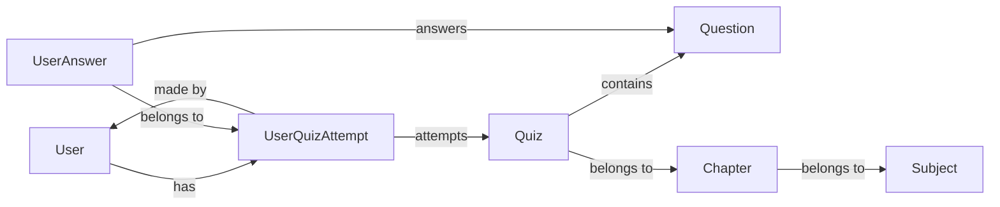

# 🌟 **IITM App Development - 1 Capstone Project** 🌟
## 🌟 **Ischool Quiz App** 🌟  
### ✨ **A Robust and Scalable Quiz Management System** ✨

---

  

Welcome to the **Ischool Quiz App**, where technology meets innovation! A **powerful and scalable platform** designed to optimize the creation, deployment, and evaluation of online quizzes with a focus on **speed**, **security**, and **user-friendliness**. Whether you are an administrator or a participant, this app is built to make your quiz experience **smooth, fun, and efficient**. 

---

## 💼 **Executive Summary**  

The **Ischool Quiz App** is a **secure**, **scalable**, and **feature-rich** platform that streamlines quiz management. It is crafted using the robust **Flask** framework, the lightweight **SQLite** database, and the modern UI framework **Bootstrap**. With powerful administrative tools and **real-time performance analytics**, the app is designed to elevate the quizzing experience for both users and administrators.

---

## 🖥️ **Technology Stack** 🖥️  

###  🐍 **Backend**
- **Flask** – A lightweight Python web framework for building scalable web apps with minimal code.  
- **Flask-SQLAlchemy** – Object-Relational Mapping (ORM) for effortless database management.  

###  💾 **Database**  
- **SQLite** – A fast, lightweight, and simple relational database engine.

### 🎨 **Frontend**  
- **Bootstrap** – A responsive, mobile-first design framework ensuring a sleek and modern user interface.  
- **Jinja2** – A powerful templating engine that allows dynamic HTML rendering with ease.

### 🧙‍♂️ **Key Libraries**  
- **Flask Core Modules**:  
   🌟 `render_template` – Renders dynamic HTML templates for each request.  
   🔄 `request` – Captures and processes form inputs and user data.  
   ⚡ `flash` – Displays backend messages to the frontend in a friendly manner.  
  🌍 `url_for` & `redirect` – Ensures smooth navigation and URL routing.  

---

## 🚀 **Core Functionalities & Features**  

### 🎛️ **Administrative Capabilities**:  
- 💻 **Full CRUD Operations**: Effortlessly manage subjects, chapters, quizzes, and questions.  
- 🔥 **Real-Time Analytics**: Track quiz performance, user engagement, and progress through a stunning dashboard.  
- 👤 **User Management**: Activate, suspend, or delete users as needed.  
- 🔍 **Advanced Search & Filtering**: Find data instantly with powerful and intuitive filters.

### 👥 **End-User Functionalities**:  
-  🔐**Secure Authentication**: Users log in securely to access their personalized data.  
- 📊**Personalized Dashboard**: View performance metrics, review past quizzes, and set new goals.  
- ⏱️**Real-Time Quiz Participation**: Engage in quizzes with an integrated timer and instant answer validation.  
-  📈**Post-Quiz Analytics**: Detailed score breakdown, correctness analysis, and insightful feedback.  
- 🔍 **Advanced Search**: Find quizzes by subject, chapter, date, or performance.  

---

## 💡 **Operational Workflow**  

### 🧑‍💼 **Administrator Process Flow**:  
1. 🎮**Admin Dashboard**: Secure control panel to easily access key functionalities.  
2. 📝**Quiz Configuration**: Configure quiz parameters like subject, chapters, scoring, and timing.  
3. 📊**Question Bank Management**: Create and manage multiple-choice questions, including answers and options.  
4. 🔑 **User & Data Governance**: Monitor performance, manage user access, and generate insightful reports.  

### 👨‍🎓 **User Engagement Process**:  
1. 🛡️ **Authentication & Access**: Users securely log in to access quizzes and their data.  
2. 📚 **Quiz Selection & Participation**: Browse available quizzes and engage in live participation.  
3. ⏳ **Answer Submission & Validation**: Submit answers and receive immediate feedback and validation.  
4. 🏅 **Performance Review**: Analyze quiz results, identify mistakes, and get improvement suggestions.

---

## 🗃️ **Database Schema**  

### 📊 **Mermaid.js Database Diagram**  

## 🏗️ Here’s a **visual representation** of the system’s **database schema** 🏗️


---

🔗 **For more information, view the detailed PDF report**: [Ischool Quiz App Report](https://github.com/daiwik-project/MAD-1-Project-iitm/blob/main/MAD%20REPORT.pdf)

---

#### To Run the App
1. [Download the Zip](https://github.com/daiwik-project/MAD-1-Project-iitm/archive/refs/heads/main.zip)
2. Unzip the folder then Open Folder in Terminal
3. Type this command 
```script
pip install -r requirements.txt
python app.py
```
